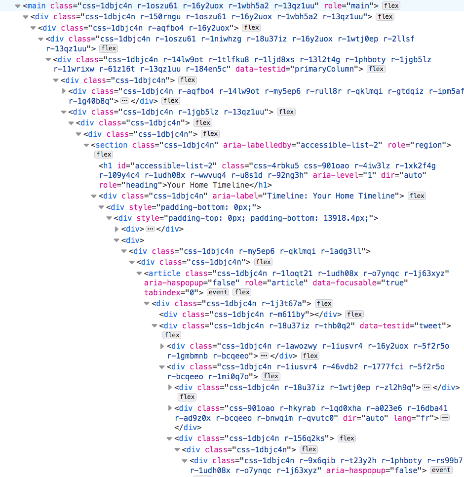
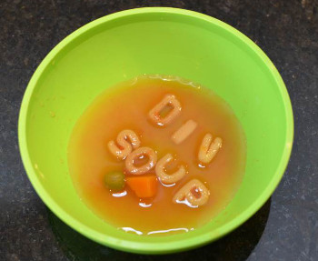

# The `<div>` division

The `div` element is used everywhere to group elements together into sections.

## Examples

```html
<div>
   <p>Content<p>
   <p>Content<p>
</div>
```

```html
<div class="page-header">
   <h1>Main Heading<h1>
   <h2>Sub-heading</h2>
</div>
```

NB: Unlike lists and headers, the `div` has no semantic meaning.


## Don't be like Twitter


### Div soup

