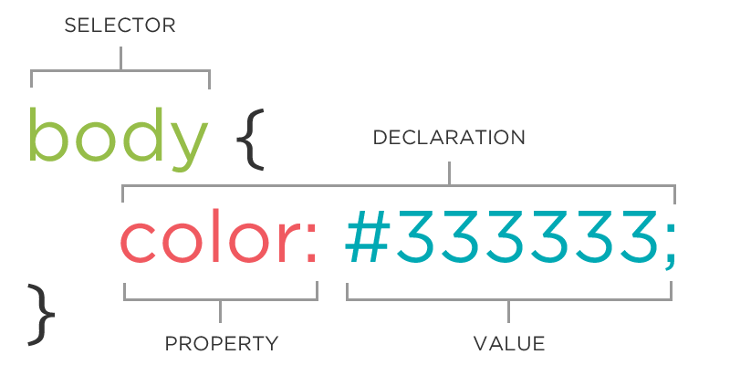

# CSS vocabulary



```css
selector {
  property: value;
}
```

* A block of CSS code is a **rule**.
* The rule starts with a **selector**.
* It contains one or more **declarations**.
* A declaration consists of a **property** and its **value(s)**.
